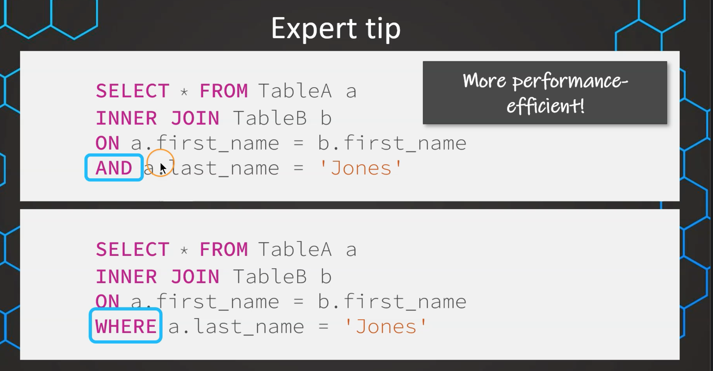

# Order of execution of a Query
**SELECT DISTINCT** column, AGG_FUNC(column_or_expression), …

**FROM** mytable
    **JOIN** another_table
      **ON** mytable.column = another_table.column

**WHERE** constraint_expression

**GROUP BY** column

**HAVING** constraint_expression

**ORDER BY** column ASC/DESC

**LIMIT** count **OFFSET** COUNT;

# Logical Query Processing:

**FROM and JOINs**: У цьому кроці визначається, з якої таблиці чи таблиць потрібно вибирати дані. Якщо в запиті є декілька таблиць, вони об'єднуються за допомогою операції JOIN.

**WHERE**: Умови, вказані в розділі WHERE, фільтрують дані, вибираючи тільки ті рядки, які відповідають умовам.

**GROUP BY**: Якщо в запиті є групування (GROUP BY), дані групуються за вказаними полями.

**HAVING**: Умови, вказані в розділі HAVING, фільтрують групи, залишаючи лише ті, які задовольняють умовам.

**SELECT**: Визначається список колонок, які вибираються для виводу.

**ORDER BY**: Результати можна впорядкувати за допомогою ORDER BY вказаним полем чи полями.

**TOP (або LIMIT)**: Вибрані рядки можуть бути обмежені за допомогою TOP (в SQL Server) або LIMIT (в багатьох інших СУБД)

**OFFSET**: dictates the number of rows to skip from the beginning of the returned data before presenting the results. 

# JOIN VS UNION

## JOIN

USING(...id)

**Joins on Multiple conditions**

## UNION
**INTERSECT** and **EXCEPT**

# CTE (Common Table Expression)

# Window functions
https://data-life-ua.com/db/mastering-sql-window-functions-guide/

    SELECT column_name,
       WINDOW_FUNCTION(column_name) OVER (  
           PARTITION BY column_name  
           ORDER BY column_name  
           RANGE/ROWS BETWEEN ... AND ...  
       )
    FROM table_name;

**Функція**: Це може бути SUM, AVG, MAX або будь-яка інша функція, яка вам потрібна. Зазвичай це є серцем (математичної) операції, яку ви хочете виконати! Ці функції подібні до звичайних агрегаційних функцій, але не зменшують кількість повернутих рядків.

**OVER()**: Ця частина дозволяє визначити “вікно” або підмножину даних, яку функція буде обробляти.

**PARTITION BY**: (*Необов’язково*) Якщо ви хочете виконати розрахунки на конкретних частинах (групах) ваших даних, так ви вказуєте SQL розділити речі. Якщо не вказано PARTITION BY, функція розглядає всі рядки результату запиту як єдиний розділ. Вона працює подібно до GROUP BY, але, в той час як GROUP BY агрегує дані, PARTITION BY цього не робить, вона просто групує дані для віконної функції.

**ORDER BY**: (*Необов’язково*) Воно сортує рядки всередині кожного розділу. Якщо не вказано ORDER BY, функція розглядає всі рядки розділу як єдину групу.

## Ranking (Віконні функції ранжування):
RANK(): Ця функція присвоює унікальний ранг кожному відмінному рядку в межах розділу результатів. Ранги присвоюються в порядку, визначеному в розділі ORDER BY клавіатури в клавіатурі OVER(). Якщо два чи більше рядки мають однаковий ранг, кожен такий рядок отримує однаковий ранг, і наступні ранги пропускаються.

DENSE_RANK(): Ця функція працює схоже до RANK(), але, якщо два чи більше рядки мають однаковий ранг, наступний ранг не пропускається. Таким чином, якщо у вас є три елементи з рангом 2, наступний ранг буде 3.

ROW_NUMBER(): Ця функція присвоює унікальний номер рядка кожному рядку в межах розділу, незалежно від дублікатів. Якщо є однакові значення в упорядкованому наборі, вона все одно присвоює різні номери рядків кожному рядку.

Функція NTILE() використовується для розділення впорядкованого розділу на вказану кількість груп, або “плиток (tiles)”, і присвоює номер групи кожному рядку в розділі. Це може бути корисно для поділу набору даних на квартилі, децилі, або будь-який інший набір рівномірно розміщених груп.

## Value (Функції віконного значення):
FIRST_VALUE(): повертає перше значення в упорядкованому наборі значень з розділу.  
*Наприклад, ви можете використовувати цю функцію, щоб знайти першу здійснену продажу продавцем.*

LAST_VALUE(): повертає останнє значення в упорядкованому наборі значень з розділу. *Її можна використовувати для знаходження найбільш останньої суми продажу для певного продукту.*

LEAD(name, 1): дозволяє отримувати доступ до даних з наступних рядків у тому ж самому наборі результатів, надаючи можливість порівнювати поточне значення зі значеннями з наступних рядків. *Вона корисна для обчислення різниці в сумах продажів між двома послідовними днями.*

LAG(name, 1): дозволяє отримувати доступ до даних з попередніх рядків у наборі результатів, без потреби в самостійному з’єднанні. *Це може бути корисно для порівняння поточних даних з історичними даними.*

# ALTER / INSERT / DROP

**CREATE TABLE - створюємо нову таблицю**     `CREATE TABLE test(
		col_1 text
		,col_2 int
)
;`

**ALTER + ADD - додаємо нову колонку**  
`ALTER TABLE test
ADD COLUMN col_3 text
;`

**ALTER + RENAME - перемейновуємо колонку**  
`ALTER TABLE test
RENAME COLUMN col_3 to col_4
;`

**ALTER + DROP COLUMN - видаляємо колонку**  
`ALTER TABLE test
DROP COLUMN col_4
;`

**INSERT INTO + VALUES - додаемо рядки (значення)**  
`INSERT INTO test (col_1, col_2)
VALUES ('text', 1)
;`

**CREATE table - створення дублікату таблиці**  
`CREATE TABLE test_copy AS
SELECT * FROM test t 
;`

**DROP table - видалення таблиці**  
`DROP TABLE test_copy;`

## Can be useful

**ENUM** is short for enumeration, meaning it consists of a predefined list of values that a variable or column can take.

**JULIANDAY** can find diff between two days  
`SELECT JULIANDAY('2022-12-31') - JULIANDAY('2022-01-01') AS days_diff;`

**LIMIT / TOP / ROWNUM**  
SQL Server uses SELECT TOP. MySQL uses LIMIT, and Oracle uses ROWNUM (with =).

**DATE_ADD()**  function adds a time/date interval to a date and then returns the date.  
`SELECT DATE_ADD("2017-06-15", INTERVAL 10 DAY);`

**DATEDIFF()** function returns the number of days between two date values  
`SELECT DATEDIFF("2017-06-25", "2017-06-15");`

**IF() Function**  
`SELECT IF(500<1000, "YES", "NO");`
`SELECT IF(500<1000, 1, 0);`